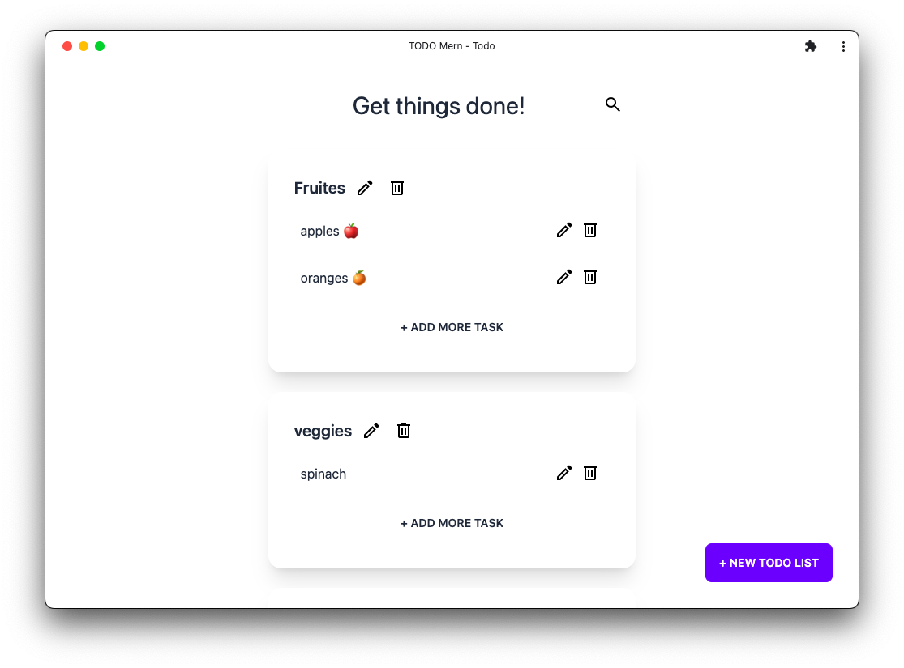

# MERN Todo

### Preview
[https://todo-mern-production.up.railway.app/](https://todo-mern-production.up.railway.app/)

### Features

- CRUD Todo List
- CRUD Tasks
- SEARCH
- Good UI
- Mobile Responsive
- PWA ⚡️

### Technologies Used

-  
-  
- 
- 
- PWA - Progressive Web App

---

### Developer: Dhruvil Patel

Github: [https://github.com/dhruvilxcode](https://github.com/dhruvilxcode)

Website: [https://dhruvilxcode.com](https://dhruvilxcode.com)